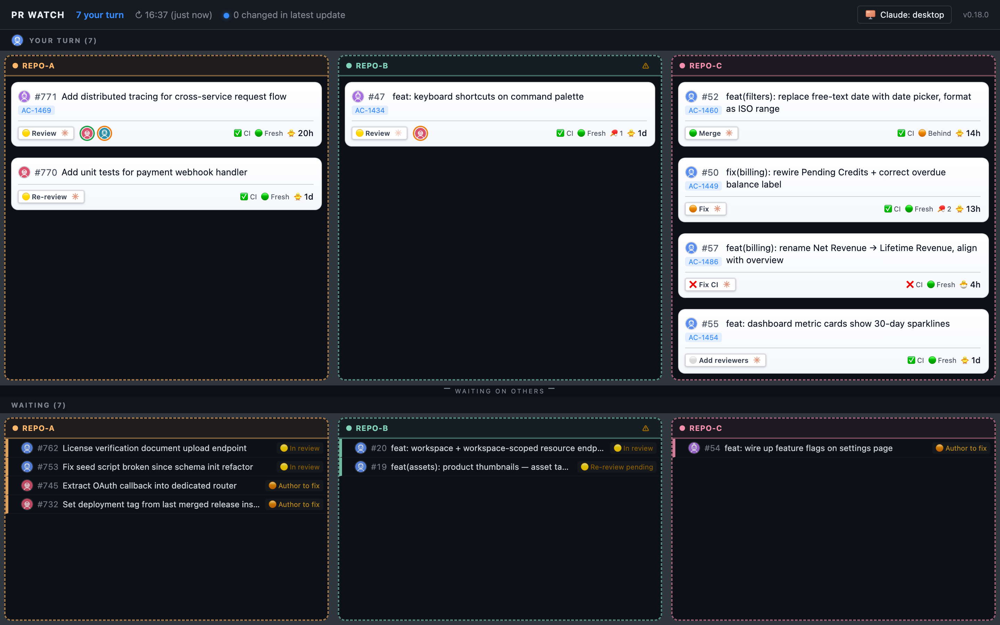

# pr-watch

You're in the middle of deep work. Somewhere, a reviewer just left feedback on your PR — or CI went red — or someone's PR is waiting on you. You won't find out until you remember to check.

`pr-watch` watches all your open pull requests and surfaces changes — review decisions, CI status, who's waiting on whom — without burning tokens when nothing is happening. A plain Node.js process does the polling entirely outside of Claude.

## Two modes

### With Claude (`/pr-watch`)

Run `/pr-watch` in a Claude Code session. Claude starts the poller as a background Monitor and renders a structured inbox every time something changes: who needs your attention, and what the next action is. The browser dashboard also opens automatically alongside it.

```
poll.mjs (Node, no tokens)          Claude
──────────────────────────          ──────────────────────────────────
polls GitHub every 2 min  ───────►  (sleeping — zero tokens)
polls GitHub every 2 min  ───────►  (sleeping — zero tokens)
CI status changed!        ───────►  wakes up, renders update, asks what to do
polls GitHub every 2 min  ───────►  (sleeping — zero tokens)
```

### Standalone (browser dashboard only)

Run the poller directly from a terminal — no Claude session needed:

```bash
node ~/.claude/pr-watch/poll.mjs
```

The browser dashboard opens at `http://localhost:7654` and updates live via Server-Sent Events. Zero token cost. Use this for ambient monitoring while you work elsewhere — just glance at the tab when you feel like it.

---

Both modes auto-stop at 18:00 by default so you never accidentally leave a session running overnight.

## Dashboard



The browser dashboard opens automatically at `http://localhost:7654` when you start pr-watch. **YOUR TURN** (top) shows the PRs that need your action as white cards: author avatar, PR number and Linear key, title, and a footer with the **action button** (Review, Fix, Merge, …) on the left and plain status labels (CI, merge state, review bounces, age) on the right. **WAITING** (bottom) shows the PRs where the ball is in someone else's court as compact dark rows. Columns are grouped by repo. A blue dot marks any PR that changed in the latest poll.

The action chip on each your-turn card (**Review**, **Fix**, **Merge**, …, with a small Claude logo) opens that PR in Claude — see [Open in Claude](#open-in-claude).

The dashboard updates live via Server-Sent Events — no page refresh needed. It is purely ambient: run `/pr-watch` in Claude for the full interactive inbox, or start `node poll.mjs` standalone and just watch the browser tab.

## Open in Claude

Click the action chip on a your-turn card and a new Claude Code session opens in your local clone of that repo, with a one-line prompt already typed: `Let's review PR #87 in acme-corp/mobile-app.`, `Let's merge…`, `Let's fix the failing CI on…`. Nothing runs until you press Enter.

It uses the links the Claude apps already understand — nothing extra to install:

| Opens in | Needs |
|---|---|
| **Claude desktop** (monitor icon) | The [Claude desktop app](https://claude.ai/download) |
| **Terminal** (`>_` icon) | Claude Code, and **one** prompt sent in an interactive `claude` session on this machine (that registers the link handler) |

pr-watch picks one for you — the desktop app if it's installed, otherwise the terminal — and prints its guess when it starts. Switch with the **Claude** button top-right; your choice is remembered. ⌥-click a chip to use the other one once.

**Finding your clone.** pr-watch looks for each repo among the folders you've used Claude Code in. A ⚠ next to a repo name means it didn't find one: that repo's chips can only open a terminal, and if Claude Code has never seen a clone either, the session starts in your home folder. Click the chip for the fix, or map it yourself:

```bash
node ~/.claude/pr-watch/repos.mjs                              # asks for each missing repo
node ~/.claude/pr-watch/repos.mjs --set acme/web=~/src/web     # or set one directly
```

### If a chip does nothing

| Symptom | Fix |
|---|---|
| Terminal chips do nothing | Run `claude` in your terminal, send any prompt, exit. That registers the handler. |
| Still nothing, and you've switched how you install Claude Code (e.g. standalone installer → npm) | The handler may still point at the old install. Remove it, then do the step above: `rm -rf ~/Applications/"Claude Code URL Handler.app"` |
| Terminal opens in the wrong app | Start `claude` once in the terminal you want; links reuse it. |
| Desktop sometimes opens a scratch session instead of your repo | A known Claude desktop issue ([anthropics/claude-code#98285](https://github.com/anthropics/claude-code/issues/98285)) — click the chip again. |
| Browser asks "Open Claude Code URL Handler?" / "Open Claude?" | Expected the first time; tick *always allow*. |

## Example output (Claude inbox)

```
━━━━━━━━━━━━━━━━━━━━━━━━━━━━━━━━━━━━━
PR inbox — updated 14:23  |  stops 18:00 (3h 37m left)
━━━━━━━━━━━━━━━━━━━━━━━━━━━━━━━━━━━━━

**── acme-corp/platform ──────────────────────**

🫵 [PR #412 — Add rate limiting to API gateway](https://github.com/acme-corp/platform/pull/412)
Role: author | CI: ✅ | Review: 🔴 CHANGES_REQUESTED
Waiting: 2d 1h 🚨
Next: 🟠 Fix — "Let's address the review feedback on PR #412 in acme-corp/platform." in ~/projects/platform

⏳ [PR #438 — Migrate auth service to Postgres](https://github.com/acme-corp/platform/pull/438)
Role: author | CI: ⏳ | Review: 🟡 REVIEW_REQUIRED
Waiting: 4h 12m
Next: waiting on CI and a reviewer

**── acme-corp/mobile-app ────────────────────**

🫵 [PR #87 — Fix crash on empty cart checkout](https://github.com/acme-corp/mobile-app/pull/87)
Role: reviewer | CI: ✅ | Review: 🟡 REVIEW_REQUIRED
Waiting: 1d 3h ⚠️
Next: 🟡 Review — "Let's review PR #87 in acme-corp/mobile-app." in ~/projects/mobile-app

⏳ [PR #91 — Dark mode follow-up tweaks](https://github.com/acme-corp/mobile-app/pull/91)
Role: author | CI: ✅ | Review: 🟢 APPROVED
Waiting: 52m
Next: waiting on reviewer to merge
```

When something changes, Claude wakes up and notes what triggered the update:

```
━━━━━━━━━━━━━━━━━━━━━━━━━━━━━━━━━━━━━
PR inbox — updated 14:41  |  stops 18:00 (3h 19m left)
━━━━━━━━━━━━━━━━━━━━━━━━━━━━━━━━━━━━━
CI changed on PR #438 — Migrate auth service to Postgres: PENDING → FAILURE

**── acme-corp/platform ──────────────────────**
...
```

## Installation

The quickest way is to tell Claude directly. Open any Claude Code session and paste:

> Install the pr-watch command from https://github.com/anneveling/ai-kit/tree/main/commands/pr-watch

Claude will read the setup instructions and copy the files into place.

For manual installation, see [CLAUDE.md](CLAUDE.md). For background on how Claude Code slash commands work, see the [Claude Code skills and commands documentation](https://code.claude.com/docs/en/slash-commands).

## Prerequisites

### Node.js 18+

The poller uses ESM and top-level `await`, which require Node.js 18 or later.

- Download: https://nodejs.org/en/download
- Or via a version manager like [nvm](https://github.com/nvm-sh/nvm): `nvm install 18`

Check your version: `node --version`

### GitHub CLI (`gh`)

All GitHub API calls go through the `gh` CLI — there are no npm dependencies.

- Install: https://cli.github.com — covers Mac (Homebrew), Linux, and Windows
- After installing, authenticate: `gh auth login`

Check it works: `gh auth status`

### Claude Code

The slash command (`pr-watch.md`) requires [Claude Code](https://claude.ai/code) with slash command support.

The poller script (`poll.mjs`) can also be run standalone without Claude Code if you want to consume the JSON event stream yourself.

---

The script validates all of the above at startup and exits with a clear message if anything is missing.

## Configuration

No configuration is required. With `gh` authenticated, `/pr-watch` works out of the box and watches all your open PRs across every org you have access to.

Optional env vars for tuning:

| Variable | Default | Description |
|---|---|---|
| `OWNER` | — | Limit to a specific GitHub org or user |
| `POLL_INTERVAL` | `120` | Seconds between polls |
| `STOP_AT` | — | Stop at a specific time today, e.g. `17:30` |
| `HOURS` | — | Stop after N hours, e.g. `4` |
| `PR_WATCH_PORT` | `7654` | HTTP port for the browser dashboard |
| `PR_WATCH_NO_DASHBOARD` | — | Set to `1` to disable the dashboard server |
| `PR_WATCH_NO_OPEN` | — | Set to `1` to start the server without opening the browser |

If neither `STOP_AT` nor `HOURS` is set, the poller auto-stops at 18:00 if started during working hours (07:00–18:00), otherwise runs for 4 hours.

---

See [CLAUDE.md](CLAUDE.md) for the full event protocol and advanced options — useful if you're adapting this to a different agent or consuming the event stream yourself.

## Ball in court

Who lands in **YOUR TURN** vs **WAITING** is documented in [BALL-IN-COURT.md](BALL-IN-COURT.md) (rules, GitHub review states, void cases, multi-reviewer overlap). For **why** the model is limited and team/process alternatives, see [WORKFLOW-NOTES.md](WORKFLOW-NOTES.md).

### Sync and test the global install

The live command uses `~/.claude/pr-watch/`, not this repo directly:

```bash
cd commands/pr-watch
./scripts/sync-global.sh          # copy to ~/.claude/pr-watch
./scripts/sync-global.sh --test   # sync + unit tests + global smoke
node ~/.claude/pr-watch/poll.mjs  # live dashboard at http://localhost:7654
```

---

## For maintainers and forkers

> This section is only relevant if you maintain or fork this repo. If you're just using the command, stop here.

The files users install are `pr-watch.md`, `poll.mjs`, `lib.mjs`, `index.html`, `styles.css`, `app.js`, and `repos.mjs`. `CLAUDE.md`, `README.md`, `package.json`, `CHANGELOG.md`, and the `test/` directory stay in the repo and are never copied to the user's machine.

**When you change any of the installed files:**

1. Bump the version in `poll.mjs` (line 2 comment and `POLLER_VERSION`), `package.json`, and `pr-watch.md` (line 1 marker and the "Installed version" line).
2. Add an entry to [CHANGELOG.md](CHANGELOG.md).
3. If the dashboard looks different, regenerate the screenshot from the fake PRs in `docs/demo.json`:
   ```bash
   node scripts/screenshot.mjs
   ```
4. Sync to your global install and run tests:
   ```bash
   ./scripts/sync-global.sh --test
   ```
   See [BALL-IN-COURT.md](BALL-IN-COURT.md) for BIC rules and manual testing.

The globally-installed copy at `~/.claude/pr-watch/` is independent of the repo — changes are not applied automatically.
